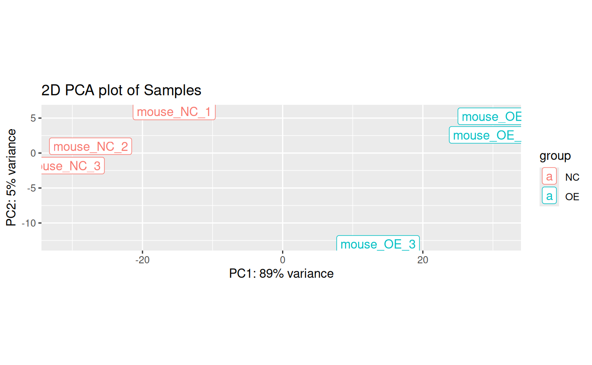
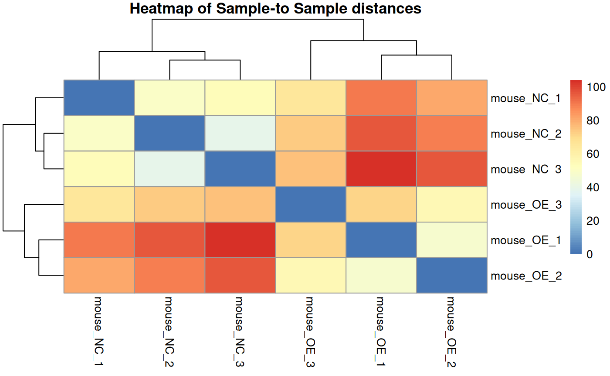
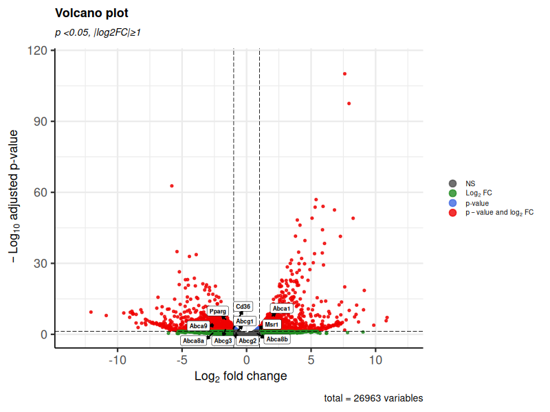
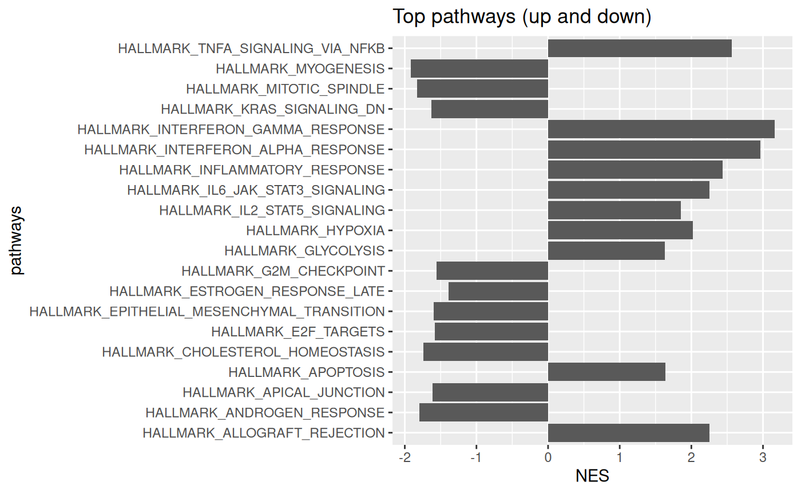

# RNA-seq Analysis of GSE236155

RNA-seq analysis of the publicly available **GSE236155** dataset using R and Bioconductor.

This project was completed as part of the **Functional Genomic Technologies** course during the MSc Bioinformatics programme at the University of Edinburgh. The analysis was developed from an R Markdown template provided by **Prof. Simon Tomlinson** and was adapted for GSE236155, with dataset-specific processing, visualization, downstream analysis and interpretation.

## Overview

The analysis compares two experimental groups:

* **NC** – control samples
* **OE** – overexpression samples

The dataset contains six mouse RNA-seq samples, with three biological replicates in each group.

The workflow includes:

* preparation of sample metadata
* filtering of low-count genes
* library-size normalisation using DESeq2
* exploratory analysis using PCA and sample-distance heatmaps
* differential gene-expression analysis with DESeq2
* annotation of Ensembl gene identifiers using `biomaRt`
* visualisation of differential expression using MA plots and volcano plots
* examination of genes highlighted in the original study
* gene-set enrichment analysis using `fgsea`
* investigation of enriched Hallmark pathways and leading-edge genes

## Analysis workflow

### 1. Data preparation

The supplied count matrix is converted into a `DESeqDataSet`, together with sample metadata describing the experimental condition.

Genes with very low read counts are removed prior to downstream analysis.

### 2. Normalisation and exploratory analysis

DESeq2 size factors are estimated to account for differences in sequencing depth between samples.

regularised log transformation (rlog) used for plots

Sample relationships are assessed using:

* principal component analysis (PCA)
* sample-distance heatmaps

### 3. Differential expression

Differential expression between the **OE** and **NC** groups is tested using **DESeq2**.

The analysis generates:

* log2 fold changes
* Wald statistics
* raw p-values
* multiple-testing-adjusted p-values

Differential-expression results are explored using the DESeq2 MA plot.

### 4. Gene annotation

Ensembl gene identifiers are mapped to gene names and additional annotation using the `biomaRt` package.

Annotated results are then used for downstream visualisation and biological interpretation.

### 5. Visualisation

The analysis includes:

* PCA plot
* sample-distance heatmaps
* MA plot
* volcano plot

A set of genes discussed in the original study is highlighted for comparison with the results of this reanalysis.

### 6. Gene-set enrichment analysis

Genes are ranked using the DESeq2 Wald statistic and analysed with **fgsea**.

Hallmark gene sets are used to identify pathways enriched toward either end of the ranked gene list.

The analysis includes:

* enrichment plots for selected pathways
* tables of highly enriched pathways
* comparison of positively and negatively enriched pathways
* collapsed pathway results
* examination of leading-edge genes from selected pathways

## Main tools and packages

The analysis is primarily performed in **R** using:

* `DESeq2`
* `Bioconductor`
* `biomaRt`
* `fgsea`
* `EnhancedVolcano`
* `pheatmap`
* `ggplot2`
* `dplyr`
* `edgeR`
* `limma`

Package and R version information can be reproduced using the `sessionInfo()` output included at the end of the analysis.

## Data availability

The RNA-seq experiment analysed here is publicly available through NCBI GEO under accession:

**GSE236155**

The analysis starts from a course-provided R object named `mytable_feaures` prepared by **Prof. Simon Tomlinson**. The object contains the gene-level count matrix (STAR aligned) used in this analysis, accessed as mytable_feaures$counts. Rows represent mouse Ensembl gene IDs and columns represent the six RNA-seq samples.

**This course-provided object is not distributed in this repository.**

Users wishing to reproduce the analysis independently should obtain the corresponding public sequencing data from GEO and generate an appropriate gene-count matrix.

## Repository contents

```text
.
├── README.md
├── figures
└── GSE236155_RNAseq_analysis.Rmd
```

Generated result tables and figures may also be produced when running the R Markdown analysis.

## Key results

### Sample-level quality assessment

PCA was used to examine global expression patterns and assess similarity between biological replicates.



**Interpretation:** Replicates from the same treatment cluster together and there is a clear separation between OE and NC groups with PC1 explaining 89% of the variance.

A sample-distance heatmap provided an additional view of similarity between samples based on rlog-transformed expression values.



**Interpretation:** within-condition samples were more similar to each other than to samples from the other condition

### Differential expression

Differential expression between OE and NC samples was assessed using DESeq2. Positive log2 fold changes indicate higher expression in OE relative to NC.



**Interpretation:** The volcano plot summarises both the magnitude and statistical significance of expression changes. Genes highlighted in the source study were labelled to compare the present analysis with previously reported biological findings. Results were consistent with the original volcano plot in the study.

### Functional enrichment analysis

Differential-expression Wald statistics were ranked and analysed against mouse Hallmark gene sets using fgsea.



**Interpretation:** Positive normalised enrichment scores indicate pathways enriched toward genes with higher expression in OE, whereas negative scores indicate enrichment toward genes with higher expression in NC. The strongest enriched pathways provide a pathway-level summary of transcriptional differences between the two conditions.


## Author

**Sanny Bold**
MSc Bioinformatics
University of Edinburgh
